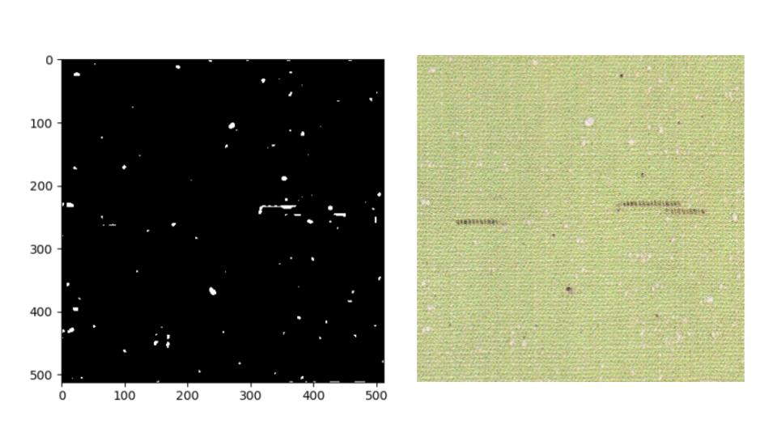

[Final Project]{.underline}

[Digital Image processing]{.underline}

The final project for the digital image processing class consisted of
identifying the defects in the fabric. When we sew cloth from the
threads, multiple stitching patterns like weft yarn, interlacing warp,
are used. Furthermore, the cloth can undergo coloring processes. There
can be irregularities in each of the steps. Currently, human eyes are
used to identify the defect, but humans are prone to make mistakes.
Hence automation is needed in this job. Different image processing
techniques learned throughout the class are used in this project to
solve this problem.

**[Approach]{.underline}**

Human eyes can identify the defect in multiple ways. For the purpose of
this project, the identification of the defect can be categorized into 2
main types related to pattern asymmetry

1.  Depth asymmetry:- If there is something popping off or something
    > dropping irregularly compared to the plain surface.

2.  Global vs Local asymmetry:- If there is something different in a
    > local region on a surface compared to the whole region.

**[Implementation]{.underline}**

Using the approach mentioned above, the defects were split into 4 main
types Foreground, Background, and Special(Holes and Coloring). For each
of these categories, separate models were built. All images were
converted to the grayscale before processing.

[Basic Processing blocks Used]{.underline}

1.  Histogram equalization:- The image were taken in different lighting
    > conditions and were made of different coloring patterns. Histogram
    > equalization guaranteed equal spread of contrast over the image.

2.  Mean Filter:- Helped remove the Poisson noise.

3.  Median Filter:- Helped to remove the salt paper noise.

4.  NLMeans Denoising Algorithm:- Removed nonlocal noise by comparing
    > one pixel to the mean of the global image.

5.  Morphological closing:- Used to fill the holes in the images

6.  Morphological opening:- Used to remove small noise from the image

7.  Fourier filtering:- Composed of high pass and low pass box filter
    > for 10 and 120 image frequencies respectively.

8.  Wiener filter:- Helps remove speckle noise caused by the image
    > capture device(Camera)

9.  Dilation:- Use to enlarge the image pixels

10. Erosion:- Used to remove small objects from the image.

11. Level slice:- Convert the image to binary 0 and 255.

12. Bitwise Invert:- Invert the image pixels. Eg:- 25-\> (255-25) 230

[Foreground Defect]{.underline}

Model

{width="6.083333333333333in"
height="3.8281255468066493in"}

Results

{width="5.640625546806649in"
height="3.1761712598425196in"}

Analysis: You can see in the above figure, the defect's edges are not
apparent because of closing operation but the defect is correctly
recognized.

{width="6.5in"
height="3.6527777777777777in"}

Analysis: You can see in the above figure because of spacial filters,
the edges of the circle are degraded hence we see a smaller defect.

{width="6.5in"
height="3.6527777777777777in"}

Analysis: From the above image, you can see the defect has been
correctly recognized although it is split into two parts due to opening.
Also, we see little white noise in the image conveying we might one more
blur filter.

[Background Defect]{.underline}

Model

{width="5.787037401574803in"
height="3.2552088801399823in"}

Results

{width="6.5in"
height="3.6527777777777777in"}

Analysis: From the above image, we can see, the defect has been well
identified, although the complete defect is not visible. Huff transform
seems to be needed in this image for accurate detection.

{width="6.5in"
height="3.6527777777777777in"}

Analysis: From the above image, we can see the spotty defect has been
identified accurately but the stripe defect is missing the complete
texture, due to spatial filtering

{width="6.5in"
height="3.6527777777777777in"}

Analysis: From the above image, we can see the defect has lost its edges
and instead has spotted texture because of closing.

[Holes Defect]{.underline}

{width="5.638888888888889in"
height="3.1718755468066493in"}

Results

{width="6.5in"
height="3.6527777777777777in"}

Analysis: From the above image, we can see the defect's main region has
been identified but the method proposed is struggling to get the
complete defect especially the verticle lines because of mean filtering.

[Coloring Defect]{.underline}

Model

{width="4.549496937882765in"
height="2.5677088801399823in"}

Results

{width="6.5in"
height="3.6527777777777777in"}

Analysis: From the above image, you can see that defect is well
established but the detection is not accurate in all regions middle
black spots. Also, we see the defect detected is squarey mainly because
of dilation and inversion. Because of the square characteristics, the
defect is missing the original shape.

[Future Work]{.underline}

For future work,

1.  Image feature extraction can be done through Machine learning
    > processing.

2.  Special R, G, B layer processing can help to filter the defect more
    > accurately.

3.  Global prior information for calibrating the model for image
    > processing can also increase the performance.

4.  Depth sensing camera can help recognize defect more accurately

5.  A good one single denoising algorithm like AIDA can help filter the
    > data more accurately.
